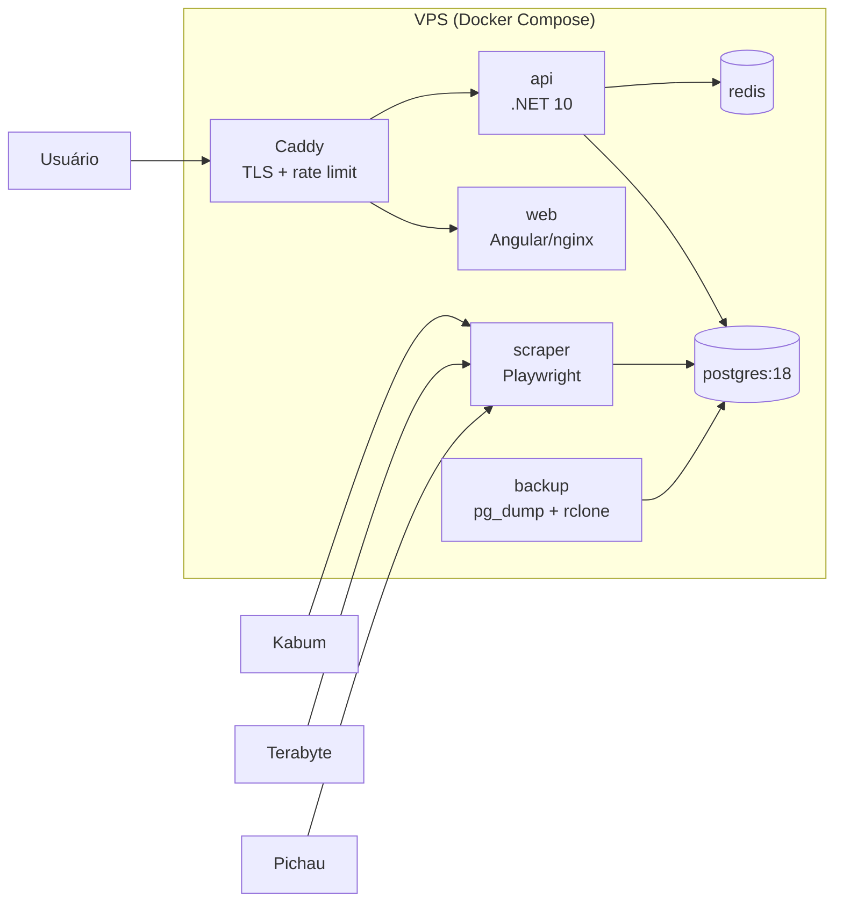
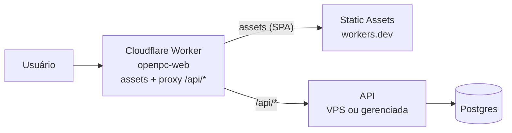

# OpenPC

Agregador de preços de hardware (Kabum, Terabyte, Pichau) com montador de PC
guiado por engine de compatibilidade — o "PCPartPicker brasileiro".

- Catálogo unificado de peças com **menor preço por loja** e histórico de preço.
- Montador de PC com **filtragem automática de peças incompatíveis** (socket,
  chipset, DDR, dimensões, potência da fonte) e avisos contextuais.
- Preço total do build otimizado por loja + link direto para cada peça.
- Ofertas (maiores quedas em 24 h/7 dias) e alertas de preço por e-mail
  (magic link, sem conta).
- Builds compartilháveis por link público.

Especificação e decisões: [`docs/specs.md`](docs/specs.md) ·
Roadmap: [`docs/roadmap.md`](docs/roadmap.md) ·
Findings de scraping: [`docs/scraping-findings.md`](docs/scraping-findings.md)

---

## Stack

| Camada | Tecnologia |
|---|---|
| `web` | Angular 22 (zoneless, signals, standalone) + Tailwind v4 |
| `api` | ASP.NET Core 10, EF Core 10, Minimal APIs, rate limiting por IP |
| `scraper` | .NET 10 Worker Service + Playwright (Chromium) |
| `minio` | MinIO/S3 — fotos do catálogo (self-hosted, servidas em `/images/*` via Caddy) |
| `db` | PostgreSQL 18 |
| `redis` | Redis 8 (cache de listagens) |
| `caddy` | Caddy 2 (imagem padrão — TLS, proxy) |
| `backup` | pg_dump + rclone → S3 (off-site) |

## Estrutura do monorepo

```
src/OpenPc.Domain/          # entidades, engine de compatibilidade (puro)
src/OpenPc.Infrastructure/  # EF Core, migrations, seeds, cache
src/OpenPc.Api/             # API HTTP (catálogo, builds, ofertas, alertas)
src/OpenPc.Scraper/         # collectors (Kabum/Terabyte/Pichau) + jobs Quartz
web/                        # SPA Angular
deploy/                     # compose (dev/prod), Caddyfile, backup, smoke test
tests/                      # testes de domínio e scraper
docs/                       # specs, roadmap, findings de scraping
```

## Desenvolvimento local

Stack completa (db + redis + api + web + scraper):

```bash
docker compose -f deploy/docker-compose.dev.yml up --build -d
```

| Serviço | URL |
|---|---|
| web | http://localhost:4200 |
| api | http://localhost:5080 (`/api/v1/health`) |
| db | localhost:5432 (`openpc` / `openpc` / `openpc_dev`) |
| redis | localhost:6379 |

Alternativa sem containers para web/api (SDK local):

```bash
cd web && npm start             # proxy /api -> localhost:5080
dotnet watch run --project src/OpenPc.Api
```

### Cenários de execução

1. **Só a API** (db + redis + api — reusa o banco de dev):

   ```bash
   docker compose -f deploy/docker-compose.dev.yml up -d --build db redis api
   ```

2. **Só o scraper** (db + migrate one-shot + scraper — o schema é criado pelo
   serviço `migrate`, que roda a API com `--migrate-only`):

   ```bash
   docker compose -f deploy/docker-compose.dev.yml up -d --build db scraper
   # coleta manual (ex: Kabum, categoria cpu):
   docker compose -f deploy/docker-compose.dev.yml exec scraper \
     dotnet run --project src/OpenPc.Scraper/OpenPc.Scraper.csproj -- run-once kabum cpu
   ```

3. **Front na Cloudflare Worker** (serve o SPA na edge e faz proxy de `/api/*`
   para a API local ou remota — ver seção Deploy):

   ```bash
   cd web
   cp .dev.vars.example .dev.vars    # API_ORIGIN=http://localhost:5080
   npm run dev:cf                    # local: http://localhost:8787
   ```

---

## Opções de deploy

### Opção A — VPS com Docker Compose (tudo em um host)

Produção atual (M5): o Caddy expõe 80/443 com TLS automático e roteia
`/api/*` para a API e o resto para o front (nginx/SPA). Scraper, db, redis e
backup ficam na rede interna, sem porta exposta.



**Requisitos:** VPS com Docker e um domínio apontando para o IP (TLS via
Let's Encrypt). Para o Chromium do scraper, recomendado **≥ 8 GB de RAM**
(o scraper consome ~1,5 GB sob carga; somando API+db+redis, 4 GB fica
apertado).

**Deploy:**
1. Na VPS, crie `deploy/.env` a partir de `deploy/.env.example`:
   `DOMAIN`, `POSTGRES_PASSWORD`, `ALERTS_WEBHOOK_URL` (opcional),
   `RCLONE_*` (backup off-site, opcional).
2. No GitHub, configure os secrets: `VPS_HOST`, `VPS_USER`, `VPS_SSH_KEY`,
   `VPS_DOMAIN`, `VPS_APP_DIR` (default `/opt/openpc`), `GHCR_PAT`.
3. Push de uma tag `vX.Y.Z` → o workflow `.github/workflows/deploy.yml`
   builda as imagens (api, scraper, web, backup) → GHCR → SSH na VPS
   (`compose pull && up`) → smoke test pós-deploy. O Caddy usa a imagem
   padrão `caddy:2-alpine` (sem build) e o **rate limit por IP (60 req/min
   em `/api/*`, 429) vive na API** — ASP.NET RateLimiter, configurável via
   `RateLimit__ApiPerMinute`.

Para subir localmente (build em vez de pull):

```bash
docker compose -f deploy/docker-compose.yml --env-file deploy/.env up -d --build
```

### Opção B — Front na Cloudflare Worker + backend separado

O SPA é servido por **Workers Static Assets** na edge (workers.dev — não
precisa de domínio — ou domínio próprio) e o Worker faz **proxy de `/api/*`**
para `API_ORIGIN`. O front usa caminhos relativos, então o browser só fala
com o origin do Worker: **sem CORS**, e a API pode estar na VPS (Opção A)
ou em qualquer provedor.



**Local:**

```bash
cd web
cp .dev.vars.example .dev.vars    # API_ORIGIN=http://localhost:5080 (cenário 1)
npm run dev:cf                    # http://localhost:8787
```

**Publicar:**

```bash
cd web
npm run deploy:cf                 # usa API_ORIGIN do wrangler.jsonc
# com outra origem (ex: a API na VPS):
npm run deploy:cf -- --var API_ORIGIN:https://openpc.example.com
```

A config vive em `web/wrangler.jsonc` (worker em `web/worker/index.ts`):
`account_id` fixo, `assets.directory` = `dist/web/browser`, fallback SPA
(`not_found_handling: single-page-application`) e `run_worker_first: ["/api/*"]`
— só as rotas de API passam pelo Worker; o resto é servido direto dos assets.

### Comparativo

| Critério | A — Tudo na VPS | B — Front na edge |
|---|---|---|
| Latência do front | Depende da VPS | Global (CDN Cloudflare) |
| Domínio | Necessário | workers.dev basta; domínio depois |
| API | Mesmo host | VPS ou gerenciada (precisa ser pública) |
| Operação | Um compose, um host | Dois destinos (wrangler + VPS) |
| Custo | 1 VPS maior | VPS menor + Workers grátis |

O híbrido (front na Cloudflare + API na VPS) é a combinação recomendada
quando o domínio existir: front global de graça na edge e a VPS só com
backend + banco.

---

## Banco de dados em produção: **não use Postgres em container**

O Postgres em container é ótimo para desenvolvimento (reproduzível, sobe com
um comando), mas **em produção recomendamos usar um Postgres gerenciado** —
ou, no mínimo, instalado no host — em vez do container `postgres:18` do
compose. Motivos:

- **Dados presos a um volume.** O volume é o banco; um `docker compose down -v`,
  um `docker system prune -a --volumes` ou um erro humano no host apagam tudo
  sem rede de proteção. Em serviço gerenciado, dados e instância são
  independentes do seu ambiente.
- **Backup e recovery.** `pg_dump` diário funciona em qualquer cenário, mas
  recovery pontual (PITR) e restauração granular exigem WAL contínuo —
  trivial num gerenciado, manual e frágil num container.
- **Upgrades de versão.** PG 18 → 19 exige `pg_upgrade` manual no container;
  provedores gerenciados atualizam com downtime curto ou zero.
- **Alta disponibilidade.** Container único é single point of failure:
  sem failover, sem réplica de leitura, sem recuperação automática.
- **Operação.** Patching de segurança, monitoramento, storage e concorrência
  com outros containers (Chromium do scraper ~1,5 GB de RAM) ficam por sua
  conta.

**O que usar:** Neon (serverless, mais que suficiente para este volume),
Supabase (dá Auth de brinde), RDS/Aurora ou DigitalOcean Managed —
ou Postgres instalado no host da VPS com backup externo.

**Impacto no projeto: quase zero.** A camada de dados é EF Core sobre
Postgres e o app lê a connection string de `ConnectionStrings__Default` (env):
trocar o container pelo gerenciado é **mudar uma variável** (`Host=...`).
As migrations continuam rodando no startup da API com advisory lock, e o
container `backup` (pg_dump → rclone/S3) funciona igual, apontando
`PGHOST`/`PGPORT` para o banco gerenciado — ou use o backup nativo do
provedor. O Redis pode continuar em container sem problema: é cache e é
descartável.

---

## CI/CD

- `.github/workflows/ci.yml` — `dotnet restore/build/test` + build do Angular
  em todo push para `main` e pull request (portão de qualidade).
- `.github/workflows/deploy.yml` — deploy de produção disparado por tag `v*`
  ou manualmente (`workflow_dispatch`): build das imagens (api, backup, web,
  arm64) → GHCR → deploy SSH na VPS → smoke test (`deploy/smoke-test.sh`:
  health, categorias, produtos, scrapers, foto do MinIO, criação de build e
  SPA servida). O scraper **não** é buildado aqui — a coleta não roda na VPS.

### Proteção da `main` (regras de contribuição)

A branch `main` é protegida: **push direto bloqueado para todos** (inclusive
admins) — mudanças só via **pull request** com a CI verde (`.NET build +
test` e `Angular build`). Force push e deleção de branch são proibidos; a
branch de trabalho é removida após o merge (squash).

```bash
git checkout -b minha-mudanca
git add . && git commit -m "..."
git push -u origin minha-mudanca
gh pr create --fill      # CI roda; merge só com checks verdes
gh pr merge --squash
```

> ⚠️ **Pushear uma tag `v*` (ou disparar o workflow Deploy manualmente)
> deploya para produção** — não faça isso sem intenção.

## Testes

```bash
dotnet test OpenPc.slnx -c Release   # domínio (engine de compatibilidade) + scraper
cd web && npm test                   # Angular (Vitest)
```
