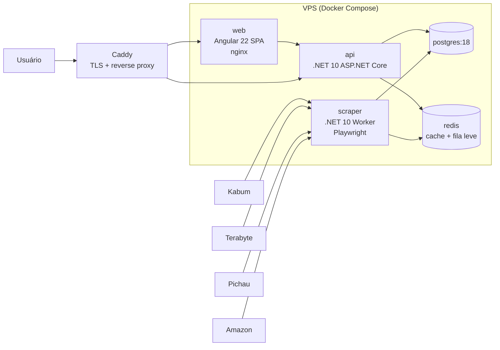
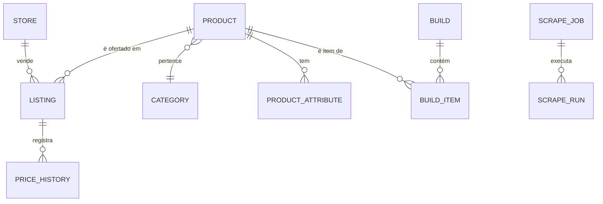
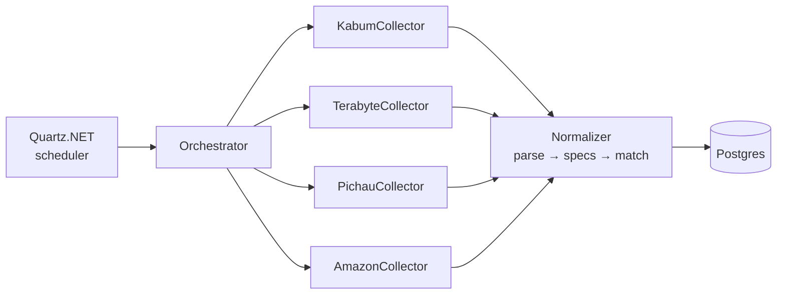

# OpenPC — Especificação Técnica

> Agregador de preços de hardware (Kabum, Terabyte, Pichau, Amazon BR) com
> montagem de PC guiada por **engine de compatibilidade**.
> Analogia: "PCPartPicker brasileiro".

- **Versão:** 0.1 (draft)
- **Data:** 2026-08-07
- **Stack:** .NET 10 · PostgreSQL 18 · Angular 22 · Docker (VPS)

---

## 1. Visão geral

### 1.1 Problema
Comprar peças de PC no Brasil exige comparar preços manualmente entre lojas
(Kabum, Terabyte, Pichau, Amazon) e validar compatibilidade por conta própria
(socket, chipset, DDR4/DDR5, dimensões, potência da fonte). Erros de
compatibilidade custam devoluções e dinheiro.

### 1.2 Produto
Web app onde o usuário:

1. Navega por um catálogo unificado de peças com **menor preço por loja** e
   histórico de preço.
2. Monta um build (CPU, placa-mãe, GPU, RAM, storage, fonte, gabinete, cooler)
   com **filtragem automática de peças incompatíveis** e avisos contextuais.
3. Recebe o preço total do build otimizado por loja (ou o menor preço individual
   por peça, com link de afiliado/direto para cada loja).
4. Salva e compartilha builds (link público).

### 1.3 Não-objetivos (v1)
- Sem checkout/carrinho próprio — o usuário compra na loja de origem.
- Sem controle de estoque em tempo real (disponibilidade é "best effort" do último scrape).
- Sem app mobile nativo (Angular responsivo/PWA).
- Sem recomendação por IA (roadmap futuro).

---

## 2. Arquitetura

### 2.1 Visão de alto nível



### 2.2 Componentes

| Componente | Tecnologia | Responsabilidade |
|---|---|---|
| `web` | Angular 22 (zoneless, signals, standalone), SSR opcional (desligado no início) | SPA pública |
| `api` | ASP.NET Core 10, EF Core 10, Minimal APIs ou Controllers | Catálogo, builds, compatibilidade, histórico de preço |
| `scraper` | .NET 10 Worker Service, Playwright (Chromium) + HttpClient | Coleta e normalização de produtos/preços |
| `db` | PostgreSQL 18 | Persistência |
| `redis` | Redis 8 (opcional na fase 1) | Cache de catálogo, idempotência de jobs, rate-limit interno |
| `caddy` | Caddy 2 | TLS automático, reverse proxy |

**Decisão:** monorepo. `src/OpenPc.Api`, `src/OpenPc.Scraper`,
`src/OpenPc.Domain`, `src/OpenPc.Infrastructure`, `web/`, `deploy/`.

**Decisão:** scraper e API como processos separados. Motivos: o scraper usa
Chromium (pesado, ~400 MB RAM), tem perfil de falha diferente (bloqueios,
seletores quebrados) e escala de forma independente. Comunicação apenas via
banco — não há acoplamento direto.

### 2.3 Banco: Postgres 18 na VPS ✅ (decidido 2026-08-07)

**Decisão:** Postgres 18 em container na VPS com volume persistente + backup
diário (`pg_dump` → rclone/S3). Supabase descartado: latência de rede externa,
menos controle sobre extensões (`pg_trgm` é essencial para o dedup) e o único
recurso com valor real (Auth) é coberto por .NET Identity + JWT sem
dependência externa. Como a camada de dados é EF Core sobre Postgres,
migrar para Supabase no futuro continua possível sem reescrita.

---

## 3. Modelo de dados

### 3.1 Diagrama ER (conceitual)



### 3.2 Tabelas

**`stores`** — lojas rastreadas.
`id, slug (kabum|terabyte|pichau|amazon), name, base_url, active, created_at`

**`categories`** — tipos de peça.
`id, slug (cpu|motherboard|gpu|memory|storage|psu|case|cooler), name, display_order`

**`products`** — produto **canônico** (normalizado, uma linha por produto real,
independente de loja).
`id, category_id (FK), brand, model, name, ean (nullable), image_url,
spec_source (scraper|manual|seed), created_at, updated_at`

**`product_attributes`** — specs estruturadas que alimentam o motor de
compatibilidade. EAV chave-valor tipado, indexado:

```
product_id (FK), key, value_text, value_num, value_bool
UNIQUE(product_id, key)
```

Chaves por categoria (contrato da engine, ver §4):

| Categoria | Chaves obrigatórias |
|---|---|
| cpu | `socket`, `tdp_w`, `memory_type` (ddr4\|ddr5\|ambos), `has_igpu`, `pcie_lanes`, `max_memory_speed` |
| motherboard | `socket`, `chipset`, `form_factor` (atx\|matx\|itx), `memory_type`, `memory_slots`, `max_memory_gb`, `m2_slots`, `sata_ports`, `pcie_x16_gen`, `bios_support` (JSON: gerações de CPU suportadas) |
| gpu | `length_mm`, `slots`, `tdp_w`, `power_connectors` (ex: `2x8pin`, `1x16pin`), `recommended_psu_w` |
| memory | `type` (ddr4\|ddr5), `modules`, `capacity_gb`, `speed_mhz`, `height_mm` |
| storage | `interface` (nvme\|sata), `form_factor` (m2_2280\|2.5\|3.5), `capacity_gb`, `pcie_gen` |
| psu | `wattage`, `efficiency` (80plus...), `modular`, `connectors` (JSON) |
| case | `supported_form_factors` (JSON array), `max_gpu_length_mm`, `max_cooler_height_mm`, `radiator_support_mm` (JSON), `psu_form_factor` |
| cooler | `type` (air\|aio), `socket_support` (JSON array), `height_mm` (air), `radiator_mm` (aio), `tdp_rating_w` |

> **Por que EAV e não colunas tipadas por categoria?** Cada categoria tem specs
> distintas e o schema evolui a cada geração de hardware (ex: LGA1851, DDR5
> CUDIMM). EAV com chaves documentadas + validação na escrita dá flexibilidade
> sem migrações constantes. Alternativa avaliada: JSONB único — descartada
> porque perdemos índices parciais e constraints por chave.

**`listings`** — oferta de um produto em uma loja (a ponte produto↔loja).
`id, product_id (FK), store_id (FK), store_sku, url, active,
last_seen_at, created_at`
`UNIQUE(store_id, store_sku)`

**`price_history`** — série temporal de preços (append-only).
`id, listing_id (FK), price_cash (à vista/pix), price_installments,
installments_count, in_stock, collected_at`
Índice: `(listing_id, collected_at DESC)`. Retenção: 24 meses, com
agregação diária para dados > 90 dias (tabela `price_daily`).

**`builds`** — montagem do usuário.
`id, slug (compartilhável), owner_id (nullable, fase com auth), name,
created_at, updated_at, is_public`

**`build_items`** — peças do build.
`id, build_id (FK), category_id, product_id (FK nullable = slot vazio),
listing_id (FK nullable = loja escolhida; se nulo, usa menor preço atual)`

**`scrape_jobs` / `scrape_runs`** — observabilidade do scraper.
`scrape_jobs: id, store_id, category_id, schedule_cron, enabled`
`scrape_runs: id, job_id, started_at, finished_at, status
(ok|partial|failed), items_found, items_new, error, duration_ms`

**`users`** (fase posterior) — `id, email, password_hash, created_at`.

### 3.3 Normalização e deduplicação (parte mais difícil)

O mesmo produto aparece com nomes diferentes em cada loja
(`"Processador AMD Ryzen 5 7600"` vs `"Ryzen 5 7600 6-Core 3.8GHz"`).
Estratégia em 3 níveis:

1. **Part number do fabricante** (validado no M1): nenhuma loja expõe EAN no
   front, mas todas carregam o part number (ex: `100-100001721WOF`, `BX8071512400F`)
   no nome ou no slug da URL. **Âncora primária** do match — extrair por regex
   e normalizar (uppercase, sem hífen).
2. **Match determinístico por tokens**: normalizar string (lower, sem acento,
   remover stopwords como "processador"/"placa de vídeo"), extrair tokens-chave
   (marca + modelo numérico, ex: `amd 7600`, `rtx 5070`). Match se o conjunto
   de tokens-chave for idêntico.
3. **Fila de revisão**: candidatos com similaridade alta mas não exata
   (`pg_trgm` `similarity > 0.6`) vão para `product_match_candidates` com
   aprovação manual via endpoint admin. EAN (quando existir) entra como
   reforço, não dependência.

---

## 4. Engine de compatibilidade

### 4.1 Design

Serviço de domínio puro (`OpenPc.Domain.Compatibility`), sem I/O:

```csharp
public interface ICompatibilityRule
{
    string Code { get; }                    // ex: "CPU_SOCKET_MISMATCH"
    CompatibilityResult Evaluate(BuildSnapshot build);
}

public sealed record CompatibilityResult(
    Severity Severity,        // Error | Warning | Info
    string Code,
    string MessagePtBr,
    Guid[] InvolvedProductIds);
```

Regras registradas por DI e executadas a cada mutação do build.
A API também expõe **filtragem** (`GET /products?category=motherboard&compatibleWith=<buildId>`)
— incompatíveis são excluídos da listagem, não apenas sinalizados.

### 4.2 Regras — Erros (bloqueiam o build)

| Código | Regra | Exemplo |
|---|---|---|
| `CPU_SOCKET_MISMATCH` | `cpu.socket != motherboard.socket` | Ryzen AM5 em placa AM4 |
| `CPU_CHIPSET_UNSUPPORTED` | CPU não consta em `motherboard.bios_support` | Ryzen 9000 em B650 com BIOS antiga |
| `RAM_TYPE_MISMATCH` | `memory.type != motherboard.memory_type` | DDR4 em placa DDR5-only |
| `RAM_CAPACITY_EXCEEDED` | `memory.capacity_gb > motherboard.max_memory_gb` | 192 GB em placa de 128 GB máx |
| `RAM_SLOT_OVERFLOW` | `memory.modules > motherboard.memory_slots` | kit 4x em placa ITX 2 slots |
| `MOBO_CASE_FORM_FACTOR` | `motherboard.form_factor ∉ case.supported_form_factors` | ATX em gabinete ITX |
| `GPU_CASE_LENGTH` | `gpu.length_mm > case.max_gpu_length_mm` | RTX 4090 (336 mm) em gabinete de 300 mm |
| `COOLER_SOCKET_MISMATCH` | `cpu.socket ∉ cooler.socket_support` | cooler AM4-only em AM5 (sem kit) |
| `COOLER_CASE_HEIGHT` | `cooler.height_mm > case.max_cooler_height_mm` | air cooler 170 mm em gabinete slim |
| `AIO_RADIATOR_FIT` | `cooler.radiator_mm ∉ case.radiator_support_mm` | AIO 360 mm sem suporte |
| `STORAGE_M2_OVERFLOW` | nº de SSDs NVMe > `motherboard.m2_slots` | 3 NVMe em placa com 2 slots |
| `PSU_CONNECTOR_MISSING` | GPU exige conector ausente em `psu.connectors` | GPU 16-pin em fonte sem 12V-2x6 |

### 4.3 Regras — Avisos (não bloqueiam)

| Código | Regra |
|---|---|
| `PSU_WATTAGE_LOW` | `psu.wattage < (cpu.tdp + gpu.tdp + 100 W overhead) × 1.4` → margem insuficiente; usa `gpu.recommended_psu_w` quando existir |
| `RAM_SPEED_CAPPED` | `memory.speed_mhz > max(cpu.max_memory_speed, mobo)` → funciona, mas capado |
| `NO_GPU_NO_IGPU` | build sem GPU e `cpu.has_igpu = false` → sem vídeo |
| `COOLER_TDP_TIGHT` | `cooler.tdp_rating_w < cpu.tdp_w × 1.1` → thermal throttling provável |
| `BIOS_UPDATE_NEEDED` | CPU suportada apenas com BIOS update (motherboard sem flashback) |
| `MIXED_STORE_SHIPPING` | peças em 3+ lojas → frete múltiplo pode anular a economia |

### 4.4 Dados de suporte

Socket/chipset/BIOS não vêm do scraping — mudam devagar e exigem precisão.
Manter **seed curado** (`Infrastructure/Seeds/compatibility.json`): matriz
CPU↔chipset↔BIOS por geração (ex: B650 + Ryzen 9000 = "BIOS ≥ AGESA 1.2.0.x").
Scraper só preenche specs físicas/elétricas; a matriz de suporte é dado
editorial versionado no repo.

---

## 5. Scraping

### 5.1 Arquitetura do coletor



Cada loja implementa `IStoreCollector`:

```csharp
public interface IStoreCollector
{
    StoreSlug Store { get; }
    IAsyncEnumerable<RawListing> CollectCategoryAsync(CategorySlug cat, CancellationToken ct);
}
```

Pipeline por listing: **fetch → parse → extract specs → match/criar produto →
upsert listing → append price**.

### 5.2 Estratégia por loja (validada no spike M1 — ver `docs/scraping-findings.md`)

**Escopo v1:** Kabum, Terabyte, Pichau. **Amazon adiada** ✅ (decidido
2026-08-07) — captcha agressivo e rotatividade de layout a tornam a loja mais
hostil; entra no backlog pós-M7 via scraping dedicado ou PA-API.

**Resultado do spike (2026-08-08): 3/3 lojas viáveis, 100% de sucesso.**

| Loja | Transporte | Fonte de dados |
|---|---|---|
| **Kabum** (piloto) | `HttpClient` puro — **sem anti-bot** | `__NEXT_DATA__` SSR: listagem (`catalogServer.data[]`: code, name, price, oldPrice, maxInstallment, thumbnail, available, manufacturer) e produto (`technicalInformation.text` = ficha técnica HTML) |
| **Pichau** | **Playwright** (Chromium **completo**, não headless-shell) — Cloudflare bloqueia curl e até a API VTEX | DOM dos cards: `de R$ X por R$ Y` (PIX), parcelas, badge de estoque; slug com part number; paginação VTEX a mapear |
| **Terabyte** | **Playwright** (Chromium completo) — Cloudflare idem | DOM dos cards: `De: R$ X por: R$ Y`, "à vista no Pix", parcelas; URL `/produto/{id}/{slug}` |

Regras de operação:
- Rate limit: Kabum 1 req/2 s com jitter; Pichau/Terabyte uma sessão de browser
  por coleta, delay 400–800 ms entre scrolls, catálogo 1×/dia.
- **Pool de 1–2 browsers** reutilizado entre coletas (o Cloudflare é resolvido
  uma vez por sessão).
- Preço da Kabum: listagem ≠ página de produto (R$ 2.163,95 vs R$ 1.289,99 no
  mesmo SKU) — validar `priceWithDiscount` como canônico no M2.
- **Sem EAN em nenhuma loja** — o dedup depende do part number do fabricante
  (presente no nome/slug de todas) + tokens marca/modelo (§3.3).

### 5.3 Boas práticas e riscos

- **Rate limiting por loja**: token bucket (ex: 1 req/2 s por domínio) +
  jitter. Respeitar `robots.txt` na medida do razoável e identificar-se com
  User-Agent honesto.
- **Risco legal/ToS**: os termos dessas lojas proíbem scraping; na prática,
  agregadores de preço operam em zona cinzenta no Brasil. Mitigação: volume
  baixo (catálogo de peças de PC é pequeno — milhares de SKUs, não milhões),
  cache agressivo, e linkar de volta para a loja (tráfego de saída qualificado
  é argumento a favor). **Não** armazenar conteúdo protegido além de specs
  factuais e preço (fatos não são copyrightable).
- **Resiliência**: seletor quebrado ≠ crash. Todo parse valida schema mínimo
  (nome + preço); falha vira `scrape_runs.status = partial` com alerta.
- **Agendamento**: catálogo completo 1×/dia (madrugada); re-scrape de preços
  das categorias mais voláteis (GPU, CPU) a cada 2-4 h; storage/case 1×/dia
  basta.
- **Idempotência**: upsert por `(store_id, store_sku)`; preço só gera linha
  nova em `price_history` quando valor ou estoque mudou.

---

## 6. API (REST, ASP.NET Core)

Base: `/api/v1`. Responses em JSON, erros em ProblemDetails (`RFC 7807`).
Paginação por cursor (`?cursor=&limit=`) nas listagens grandes.

| Endpoint | Descrição |
|---|---|
| `GET /categories` | Categorias com contagem de produtos |
| `GET /products?category=&q=&brand=&minPrice=&maxPrice=&attrs[socket]=am5&compatibleWith=&sort=price_asc` | Busca/filtro de catálogo; `compatibleWith` aplica filtro da engine |
| `GET /products/{id}` | Detalhe + specs + ofertas por loja + menor preço |
| `GET /products/{id}/prices?days=90` | Série de histórico para gráfico |
| `POST /builds` | Cria build (retorna `slug`) |
| `GET /builds/{slug}` | Build completo + preço total + resultado da engine |
| `PUT /builds/{slug}/items/{category}` | Define/troca peça do slot (re-roda engine) |
| `DELETE /builds/{slug}/items/{category}` | Limpa slot |
| `GET /builds/{slug}/compatibility` | Avaliação completa (errors/warnings) |
| `GET /builds/{slug}/price-comparison` | Otimização: menor total por combinação de lojas vs menor preço individual |
| `GET /stores` | Lojas ativas |
| `GET /health`, `GET /health/scrapers` | Liveness + status dos últimos runs |

Admin (fase posterior, protegido): fila de dedup, re-scrape manual,
gestão de seeds de compatibilidade.

---

## 7. Frontend (Angular 22)

### 7.1 Stack e convenções
- Angular 22 **zoneless** + **signals** (estado local) + Signal Forms.
- Standalone components, `inject()`, controle de fluxo nativo (`@if/@for`).
- TanStack Query não é idiomático aqui — usar `httpResource`/resource API do
  Angular 22 para dados remotos.
- UI: **Tailwind CSS + componentes próprios** ✅ (decidido 2026-08-07) —
  identidade visual própria. Base de acessibilidade via Angular Aria
  (estável no v22) para os componentes interativos (combobox do seletor de
  peças, dialogs, menus).
- i18n pt-BR apenas; moeda BRL (`Intl.NumberFormat`).

### 7.2 Páginas

1. **`/`** — home: destaques de queda de preço, builds públicos populares, CTA
   "montar meu PC".
2. **`/pecas/:category`** — listagem com filtros laterais dinâmicos por
   categoria (socket, chipset, DDR, capacidade...), ordenação por preço,
   badge de menor preço histórico, sparkline de 30 dias.
3. **`/pecas/:category/:id`** — detalhe: specs, tabela de ofertas por loja,
   gráfico de histórico (90 dias), botão "adicionar ao build".
4. **`/montar`** — o core: 8 slots (CPU → cooler). Cada slot abre seletor
   **já filtrado por compatibilidade** com o build atual. Painel lateral:
   preço total (menor preço vs por loja), wattage estimado com barra de
   margem, lista de warnings/errors com link para a peça conflitante.
5. **`/build/:slug`** — build compartilhável (público, read-only para
   visitante; clone para editar).
6. **`/ofertas`** — maiores quedas de preço das últimas 24 h/7 dias.

### 7.3 UX de compatibilidade (diferencial do produto)
- Peça incompatível **não aparece** no seletor (filtro server-side).
- Toggle "mostrar incompatíveis" para explorar, com motivo inline
  ("Socket AM5 — incompatível com sua placa AM4").
- Warnings são explicativos e acionáveis, nunca genéricos.

---

## 8. Infraestrutura e deploy

### 8.1 Estrutura Docker

```
deploy/
  docker-compose.yml          # produção (VPS)
  docker-compose.dev.yml      # desenvolvimento local
  Caddyfile
  backup/pg-backup.sh         # pg_dump diário → rclone/S3
Dockerfiles na raiz de cada app (multi-stage):
  src/OpenPc.Api/Dockerfile       # SDK 10 → aspnet:10-alpine
  src/OpenPc.Scraper/Dockerfile   # SDK 10 → runtime + Playwright deps
  web/Dockerfile                  # node build → nginx:alpine
```

Compose de produção: `caddy` (80/443), `web`, `api`, `scraper`, `db`
(volume `pgdata`), `redis`. Healthchecks em todos; `restart: unless-stopped`.
Rede interna isolada — só Caddy expõe portas.

### 8.2 CI/CD
- GitHub Actions: build + test (xUnit API/domain, Vitest/Playwright web) →
  build de imagens → push GHCR → deploy via SSH na VPS
  (`docker compose pull && up -d`).
- Migrações EF Core: aplicadas no startup da API (ou job one-shot) com lock
  de migração — nunca via scraper.

### 8.3 Requisitos de VPS (estimativa, revisado no M1)
- Scraper com Chromium **completo** (necessário para Pichau/Terabyte) é o
  gargalo: ~1,5 GB RAM sob carga com o worker .NET.
- Alvo mínimo: **4 vCPU / 8 GB RAM / 40 GB SSD**. Com 4 GB, o Chromium disputa
  RAM com API + Postgres + Redis.

---

## 9. Requisitos não-funcionais

| Área | Decisão |
|---|---|
| Observabilidade | Serilog → JSON no stdout; OpenTelemetry (traces API) exportando para Grafana/Prometheus em container (fase 5) |
| Cache | Redis para `GET /products` (TTL 5 min) e resultado de compatibilidade por build; invalidação no re-scrape |
| Integridade de preço | Nunca sobrescrever histórico; preço atual = view/projeção sobre último registro |
| Segurança | Rate limit na API (Caddy + middleware), CORS restrito ao domínio do front, secrets via `.env` fora do repo / Docker secrets |
| Backup | `pg_dump` diário comprimido, retenção 14 dias, off-site via rclone |
| Testes | Domínio (compatibilidade) com cobertura alta — é o coração do produto; scrapers com fixtures HTML versionadas (não bater na loja em teste) |

---

## 10. Decisões

| # | Decisão | Status |
|---|---|---|
| 1 | **Banco**: Postgres 18 em container na VPS (§2.3). Supabase descartado | ✅ 2026-08-07 |
| 2 | **UI**: Tailwind + componentes próprios (§7.1). Material descartado | ✅ 2026-08-07 |
| 3 | **Lojas v1**: Kabum (piloto), Terabyte, Pichau. **Amazon adiada** para pós-M7 (§5.2) | ✅ 2026-08-07 |
| 4 | **Links de afiliado** (Kabum tem programa) — monetização futura; arquitetura já guarda `listing.url` separada para permitir rewrite | backlog |
| 5 | **Auth**: necessária para salvar builds nomeados e alertas de preço. Anônimo monta e compartilha por slug sem conta (M7) | roadmap |
